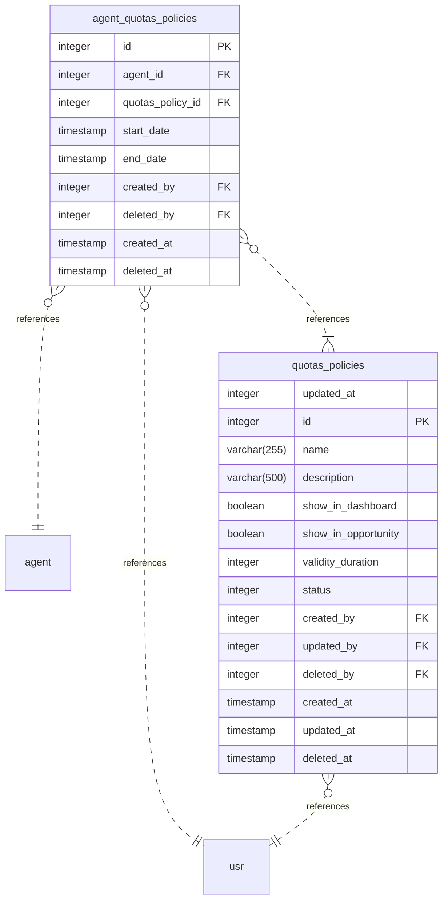

# Quota Service
Esse é um serviço criado para configurar e armazenar políticas afirmativas para o Mapas Culturais.

# Requisitos

> [!NOTE]
> Hyperf tem alguns requisitos de ambiente, podendo rodar apenas em ambientes Linux e Mac, mas também é possível a utilização de Docker em qualquer ambiente que suporte.

- PHP >= 8.1
- Qualquer uma das seguintes engines:
  - Extensão Swoole PHP ≥ 5.0，com `swoole.use_shortname` definido como `Off` no seu `php.ini`
  - Extensão Swow PHP >= 1.3
- Extensão JSON PHP
- Extensão Pcntl PHP
- Extensão OpenSSL PHP（Se você precisa utilizar HTTPS）
- Extensão PDO PHP
- Extensão Redis PHP
- Banco de Dados MariaDB ou MySQL (Caso não queira utilizar o configurado no [compose.yml](./compose.yml))

# Instalação
### Clone do projeto
SSH
```shell
git clone git@github.com:secultce/quota-service.git
```
HTTPS:
```shell
git clone https://github.com/secultce/quota-service.git
```

### Acessar o diretório
```shell
cd quota-service
```

### Copiar o .env.example e alterar os valores para o seu ambiente
```shell
cp .env.example .env
```
ou configurar diretamente no compose.yml na seção environment do serviço quota-service.

### Subir serviços com o Docker
Localmente pode usar o `docker compose up`.
> [!IMPORTANT]
Rodar as migrations:
```shell
docker compose exec quota-service php bin/hyperf.php migrate
```

### Caso precise gerar novamente o Swagger, utilizar o comando:
```shell
docker compose exec quota-service php bin/hyperf.php gen:swagger
```

> [!NOTE]
> O compose.yml está configurado para ambiente de desenvolvimento com o comando `server:watch`
> Para trocar para produção, basta alterar para `start` no compose.yml

# Documentação
## Diagrama ER


